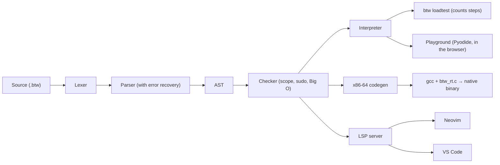

# btw

[](https://github.com/khyeo1011/btw/actions/workflows/ci.yml)

A joke programming language built from dev memes, with a real compiler: a type
checker, a Big O checker, an interpreter, an x86-64 native backend and a
language server that roasts you in VS Code and Neovim.


```
$ uv run btw check demo/roast.btw --format short
demo/roast.btw:1:1: error[E426]: Fatal: `i use arch btw` not found. Are you on Windows?
demo/roast.btw:6:23: error[E405]: npm ERR! postinstall scripts can't make network calls.
demo/roast.btw:7:1: error[E400]: Don't `break`. Go `touch grass`.
demo/roast.btw:22:23: error[E417]: You said O(n), but this is O(n²). Skill issue.
demo/roast.btw:65:5: error[E400]: `if` is a boomer conditional. Use `vibe check`.
...
```

The jokes are the surface. Underneath, the same program runs in an interpreter
and as a 14 KB x86-64 binary that prints the same bytes about 1,000 times
faster, and 1,778 tests check every roast character for character.

## Try it

**[btw.sebastianyeo.dev](https://btw.sebastianyeo.dev)** is the playground:
the real checker and interpreter, running in your browser on Pyodide. Nothing
to install. Pick an example or write your own, then press Ctrl+Enter.

To run it locally instead, clone the repo and, with [uv](https://docs.astral.sh/uv/):

```
uv sync
uv run btw run demo/fizzbuzz.btw     # FizzBuzz
uv run btw check demo/roast.btw      # get roasted 83 times
uv run btw check demo/bigo.btw       # the Big O checker
```

## FizzBuzz

```
i use arch btw
serve localhost:3000 {
    npm install i = 1
    doomscroll i <= 15 {
        vibe check i % 15 == 0 { console.log "FizzBuzz" }
        skill issue vibe check i % 3 == 0 { console.log "Fizz" }
        skill issue vibe check i % 5 == 0 { console.log "Buzz" }
        skill issue { console.log i }
        git push --force i = i + 1
    }
}
:wq
```

`uv run btw run demo/fizzbuzz.btw` and the native build
(`uv run btw build demo/fizzbuzz.btw -o fizzbuzz && ./fizzbuzz`) print:

```
1
2
Fizz
4
Buzz
Fizz
7
8
Fizz
Buzz
11
Fizz
13
14
FizzBuzz
```

## Demos

| File                | Try                                                  | What it shows                                                                                         |
| ------------------- | ---------------------------------------------------- | ----------------------------------------------------------------------------------------------------- |
| `demo/fizzbuzz.btw` | `btw run`, `btw build`, `btw asm --annotate`         | The program above, and the x86-64 assembly it compiles to                                             |
| `demo/roast.btw`    | `btw check`                                          | Every roast that fits in one file: 83 diagnostics in 148 lines                                        |
| `demo/bigo.btw`     | `btw check`, then `btw loadtest demo/bigo.btw grid`  | One microservice per Big O verdict, plus two the static checker gets wrong and `btw loadtest` catches |
| `demo/bench.btw`    | `time btw run`, then `btw build` and time the binary | Counts primes below 50,000 and finds the longest Collatz chain below 30,000. Prints 5133 and 307      |

A few roasts can't share a file, so `roast.btw` picks one of each pair: it has
E426 (no arch line first) instead of W208 (a second arch line), and E408 (no
`:wq`) instead of E410 (code after `:wq`). It has a `serve`, so no E503, and
any E400 turns off W226 for the whole file. The runtime roasts
([Runtime errors](#runtime-errors)) need a program that compiles, so they're
in `tests/golden/`.
`bigo.btw` has a soft error on purpose (E417 on `pairs`), so `btw run` refuses
it, but `btw loadtest` doesn't.

## By the numbers

|            |                                                                                          |
| ---------- | ---------------------------------------------------------------------------------------- |
| **1,200×** | native speedup on `demo/bench.btw`: 14.9 s in the interpreter, 12.4 ms as a binary       |
| **14 KB**  | the native FizzBuzz, C runtime included. No LLVM: btw writes the assembly, gcc links it  |
| **83**     | diagnostics from `demo/roast.btw`, a 148-line file                                       |
| **51**     | diagnostic messages under 31 codes, each one an HTTP status                              |
| **22**     | foreign keywords roasted on sight (`if`, `return`, `print`, `null`, ...)                 |
| **1,778**  | tests, run by CI on every pull request; about 25 s locally                               |
| **109**    | golden programs. Each one that compiles is run in the interpreter and as a native binary |
| **0**      | bytes of difference allowed between the two backends' stdout, stderr and exit code       |
| **5,156**  | lines of Python in the compiler, plus 160 lines of C runtime                             |
| **1**      | runtime dependency (pygls, for the language server)                                      |
| **5**      | TODO comments allowed per file. The 6th fails the build                                  |

Timings are from an AMD Ryzen 9 9950X3D; the native time is the mean of 50
runs.

## Keywords

| btw                          | Means                | Why                                    |
| ---------------------------- | -------------------- | -------------------------------------- |
| `i use arch btw`             | required first line  | The compiler refuses to run without it |
| `serve localhost:3000 { }`   | `main()`             | Every program is secretly a dev server |
| `:wq`                        | end of program       | The only way out, like Vim             |
| `npm install x = 5`          | `let`                | Every variable is a dependency         |
| `npm install -g X = 5`       | constant             | A global install                       |
| `git push --force x = x + 1` | assignment           | Overwriting without asking             |
| `sudo`                       | permission prefix    | Needed to change a constant            |
| `console.log`                | print                | Real debugging, in a compiled language |
| `vibe check` / `skill issue` | if / else            | Branching on vibes                     |
| `doomscroll` / `touch grass` | while / break        | Loops you can't escape                 |
| `microservice` / `ship it`   | function / return    | Shipping straight to prod              |
| `LGTM` / `404`               | true / false         | Code review and missing things         |
| `git revert x` / `git log x` | undo / print history | Undo for variables, the git way        |
| `git blame x`                | history with lines   | Find out which line did it             |
| `a \| f \| console.log`      | pipe                 | Desugars to `console.log f(a)`         |
| `npm install n = curl`       | read a number        | From stdin. At EOF: `curl: (52)`       |
| `// TODO ...`                | the only comment     | More than 5 per file fails the build   |

Numbers are signed 64-bit and wrap on overflow. The literal `404` is always
false, so the number 404 is written `403 + 1`. Full language: [docs/SPEC.md](docs/SPEC.md).

## Features

### Big O checker

Annotate a microservice with its complexity and the checker holds you to it.
`pairs` has two nested `doomscroll` loops but claims `O(n)`:

```
$ uv run btw check tests/golden/p0_e417_big_o_underclaim.btw
error[E417]: You said O(n), but this is O(n²). Skill issue.
  --> tests/golden/p0_e417_big_o_underclaim.btw:2:23
   |
 2 | microservice pairs(n) O(n) {
   |                       ^^^^
   = help: try `O(n²)`, then tell the PM it was always the plan
```

Over-claiming is W417 ("Technically correct, but this is O(1). Sandbagging your
estimates?"), a missing annotation is W102, recursion is W508 ("Complexity:
O(?). The halting problem is a skill issue.") and `O(sqrt n)` is W203 ("I can't
verify O(sqrt n). I'll take your word for it.").

### Load test

The static checker can be wrong, so `btw loadtest FILE NAME` measures instead:
it calls microservice NAME in the interpreter for n = 8 to 1024, counts loop
iterations and calls, and fits the slope of ln(steps) against ln(n) by least
squares (Language Spec 9.7). It counts, never times, so the verdict is the
same on every machine. `grid` in
`demo/bigo.btw` loops `doomscroll cells < n * n`, which the static checker
counts as n trips:

```
$ uv run btw loadtest demo/bigo.btw grid
n = 8: 65 steps
n = 16: 257 steps
...
n = 1024: 1048577 steps
static O(n). The static checker was being optimistic.
measured O(n^2.00). Your SLA says O(n). The PM has been notified.
```

It catches the opposite mistake too. `search` in the same file is a `lo`/`hi`
binary search, statically O(n), and measures `O(n^0.20). Your SLA says
O(log n). LGTM.` Diagnostics go to stderr, and soft errors like E417 don't
block it.

### sudo constants

Changing an `npm install -g` constant needs `sudo`:

```
$ uv run btw check tests/golden/p0_e403_constant_no_sudo.btw
error[E403]: Permission denied. Are you root?
  --> tests/golden/p0_e403_constant_no_sudo.btw:4:5
   |
 4 |     git push --force LIMIT = 11
   |     ^^^^^^^^^^^^^^^^^^^^^^
   = help: try `sudo git push --force LIMIT = ...`
```

`sudo git push --force LIMIT = 11` works, and so does `sudo git revert LIMIT`.
`sudo` on a variable is W100: "You didn't need sudo for that. Who hurt you?"

### Works on my machine

`// works on my machine` silences the soft errors and warnings of the next
statement or microservice, and the code still runs: a suppressed E403 really
assigns. It always leaves one warning behind, on the directive itself:

```
$ uv run btw check tests/golden/p2_w200_works_on_my_machine.btw --format short
tests/golden/p2_w200_works_on_my_machine.btw:4:5: warning[W200]: 200 OK (on my machine): 1 problem suppressed.
```

Hard errors can't be silenced. Point it at one and you get W304: "304 Not
Modified: this one doesn't work on any machine."

### HTTP status error codes

Every diagnostic code is an HTTP status picked to fit. A few, each with a golden
test in `tests/golden/` (the full catalog is Language Spec section 11):

| Code | Message                                                                |
| ---- | ---------------------------------------------------------------------- |
| E404 | Error 404: variable `x` not found. Did you forget to `npm install` it? |
| E408 | Error: program never exited. Classic Vim user.                         |
| E418 | I'm a teapot: `vibe check` needs LGTM or 404, got a number.            |
| E426 | Fatal: `i use arch btw` not found. Are you on Windows?                 |
| E429 | Error: technical debt limit exceeded (6/5 TODOs). Finish something.    |
| W509 | Infinite doomscroll detected. Go touch grass.                          |

### Git history

Every global and every variable in `serve` remembers its last 16 values.
`git revert x` restores the previous one as a new commit, and `git log x`
prints the history, newest first. After `npm install x = 1`, pushes of 2 and 3,
and two reverts, `git log x` prints `* 3 (HEAD -> x)`, `* 2`, `* 3`, `* 2`,
`* 1`, one per line (`tests/golden/p2_git_history.btw`). Reverting a variable
with one commit fails like git does: `fatal: bad revision 'x~1'`, exit code 128.
`git blame x` prints the same commits with the line that made each one, as
`* 3 (line 7)`, `* 2 (line 6)` and so on (`tests/golden/p2_git_blame.btw`).
History works in the interpreter and in native builds.

### Pipes

`3 | double | add(10) | console.log` desugars to
`console.log add(double(3), 10)`: the piped value becomes each stage's first
argument (`tests/golden/p2_pipes.btw`). Pipes work in both backends.

### curl

`curl` is the only input: it reads the next whitespace-separated number from
stdin. `tests/golden/p2_curl_sum.btw` reads a count, then that many numbers,
and prints their sum:

```
npm install n = curl
npm install total = 0
doomscroll n > 0 {
    git push --force total = total + curl
    git push --force n = n - 1
}
console.log total
```

In a global initializer it's E405: "npm ERR! postinstall scripts can't make
network calls."

### Runtime errors

A program that compiles can still fail. Each runtime error has one exact
message and exit code, the same in the interpreter and the native binary, and
the exit codes are the real ones from git and curl:

| What happened                              | stderr                                                                         | Exit |
| ------------------------------------------ | ------------------------------------------------------------------------------ | ---- |
| Division or modulo by zero                 | `Runtime error: division by zero. Have you tried turning it off and on again?` | 1    |
| More than 1,000 nested microservice calls  | `Stack overflow. Please search stackoverflow.com.`                             | 1    |
| `git revert` on a variable with one commit | `fatal: bad revision 'x~1'`                                                    | 128  |
| `curl` with nothing left on stdin          | `curl: (52) Empty reply from server.`                                          | 52   |
| `curl` reads something that isn't a number | `curl: (8) Weird server reply.`                                                | 8    |

Numbers are signed 64-bit and wrap on overflow in both backends, including the
one case x86 `idiv` traps on: the minimum number divided by -1.

## Install and build

You need [uv](https://docs.astral.sh/uv/) (it brings Python 3.12) and, for
native builds, gcc on Linux x86-64.

```
uv sync                                         # install
uv run btw check FILE.btw [--format short]      # diagnostics only
uv run btw run FILE.btw                         # interpret
uv run btw build FILE.btw [-o OUT] [--keep-asm] # native binary via gcc
uv run btw asm FILE.btw [--annotate]            # x86-64 assembly (--annotate: source lines)
uv run btw loadtest FILE.btw NAME [--args 1,n]  # measure a microservice's Big O
uv run btw lsp                                  # language server (also btw-lsp)
```

### From a release

Each [GitHub release](https://github.com/khyeo1011/btw/releases) has two
standalone ELF executables for Linux x86-64, `btw` and `btw-lsp`. They need no
Python; the C runtime is built in:

```
chmod +x btw btw-lsp && mv btw btw-lsp ~/.local/bin/
btw run hello.btw
```

`btw build` still needs gcc. `RELEASING.md` describes how
releases are made, and `CHANGELOG.md` what each one changed.

## Editor setup

Both editors start the same server, `btw-lsp`, over stdio. It reports the same
diagnostics as `btw check` on every edit and has hover text for keywords,
names, Big O annotations and TODOs, quick fixes (Add --force, Run with sudo,
Update SLA, Exit Vim, Install Arch, ...), completion, go to definition,
semantic tokens and inlay hints that show the inferred Big O of a microservice
with no SLA and write it in when clicked.

### VS Code

The extension in `editors/vscode` runs from source. Run `npm install` there once
(needs Node), open `editors/vscode` in VS Code and press F5. The Extension
Development Host window that opens has highlighting and the language server for
any `.btw` file. VS Code has to find `btw-lsp`: start it with
`uv run code editors/vscode` (close other VS Code windows first), or set
`btw.serverPath` to the absolute path of `.venv/bin/btw-lsp`.

### Neovim

Neovim 0.11 or newer. The config is `editors/nvim/btw.lua`:

```lua
vim.filetype.add({ extension = { btw = "btw" } })

vim.lsp.config("btw", {
  cmd = { "btw-lsp" },
  filetypes = { "btw" },
  root_markers = { ".git" },
})
vim.lsp.enable("btw")

vim.diagnostic.config({ virtual_text = true })
```

Try it from the repo root with `uv run nvim --cmd "set rtp+=editors/nvim" --cmd
"luafile editors/nvim/btw.lua" FILE.btw`. [editors/nvim/README.md](editors/nvim/README.md)
shows how to load it permanently, with highlighting from `editors/nvim/syntax`.

## Architecture



Each box is a module in `src/btw/`; `driver.py` runs the pipeline and `cli.py`
is the `btw` command. The parser recovers at the next line or `}`, so
half-typed code gets one squiggle, not a red file. The codegen is a stack
machine (GNU as, Intel syntax) linked with the C runtime in
`src/btw/runtime/btw_rt.c`.

## How the Big O checker works

`src/btw/bigo.py` counts nested loops over the AST (Language Spec 9.1). A
degree is a pair (k, j), meaning O(n^k log^j n), compared k first:

- A `doomscroll` costs its trip count plus the worst of its condition and
  body. Anything else costs the worst of its parts.
- The trip count is n, unless the loop has one local counter changed once per
  iteration by a literal or constant step: counting to a fixed bound from a
  literal start (`doomscroll i < 10`) is O(1), and halving or doubling is
  O(log n).
- A call costs the callee's degree, computed once per microservice by a
  memoized depth-first search over the call graph.
- A microservice on a cycle (direct or mutual recursion) is `O(?)`, and so is
  anything that calls it.

`O(1)`, `O(n^k)`, `O(log^j n)` and `O(n^k log^j n)` are checked. `O(2^n)`,
`O(c^n)` and `O(n!)` rank above all of those, so on a loop nest they're always
W417 (sandbagging). Anything else, like `O(sqrt n)`, is taken on trust (W203).
Limits: it's a teaching heuristic, not a proof. Any other loop counts as n
iterations, so a `lo`/`hi` binary search is O(n), and so is a loop up to a
bound that grew to 2^n, which makes an honest `O(2^n)` there a W417.

## How the native backend works

`src/btw/codegen.py` writes x86-64 assembly as text, with no LLVM or other
compiler library; gcc only assembles it and links in the 160-line C runtime
for printing, history and `curl`. It's a stack machine: every expression
leaves exactly one value pushed, and the stack is empty between statements.
The generator counts its pushes while it runs, asserts both rules, and uses
the count to align `rsp` to 16 bytes before every call, as System V requires.
That's also why a microservice takes at most six parameters: System V passes
six in registers, and the seventh is E413, a monolith.

`btw asm --annotate` puts each source line above its code, and the comments
keep the jokes going:

```
        # line 4: doomscroll i <= 15
.Lloop1:
        push    qword ptr [rbp - 8]     # i
        push    15
        pop     rcx
        pop     rax
        cmp     rax, rcx
        setle   al
        movzx   eax, al
        push    rax
        pop     rax
        test    rax, rax
        jz      .Lloop1_end             # 404: stop scrolling
```

## Testing

```
uv run pytest                    # everything
uv run pytest --tier 0           # golden tests for P0 only
uv run pytest -k p0_fizzbuzz     # one golden test
```

- **Golden tests.** `tests/golden/` holds 109 programs, written by hand from the
  spec and reviewed by a human, with sidecars: `.diag` (expected
  `btw check --format short` output), `.in` (stdin), `.out`, `.err` and `.exit`. The runner
  compares the diagnostics, then runs the interpreter and compares stdout,
  stderr and the exit code.
- **Differential tests.** The interpreter is the reference: every golden that
  runs is also built with gcc and must match the same files byte for byte.
  `tests/test_codegen.py` compares more programs across both backends, with a
  probe that fails if any call is made with a misaligned stack. Unit tests
  cover each component, and CI runs everything, with gcc, on every pull request.

## AI usage

AI was used for bulk of the implementation of the project. I designed the language syntax, keywords, Language specifications,
created the task cards for each Agent to own a part of the fix/feature of the language, with help from AI to polish and detail.
AI's were given a set of Golden Tests that had to be complete before marking a task complete.
