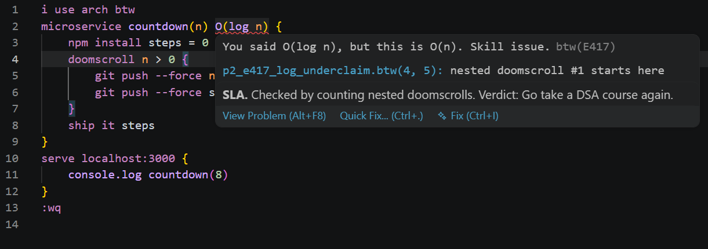
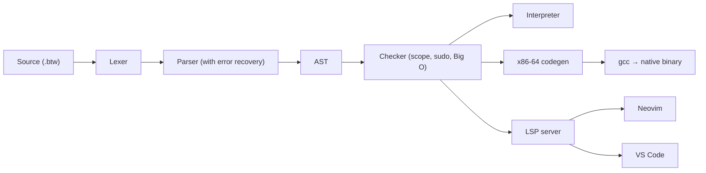

# btw

A joke programming language built from dev memes, with a real compiler: a type
checker, a Big O checker, an interpreter, an x86-64 native backend and a
language server that roasts you in VS Code and Neovim.

<!-- Screenshot placeholder: replace with a capture of VS Code showing an E417 squiggle and a hover. -->


## FizzBuzz

```
i use arch btw
serve localhost:3000 {
    npm install i = 1
    doomscroll i <= 15 {
        vibe check i % 15 == 0 { console.log "FizzBuzz" }
        skill issue vibe check i % 3 == 0 { console.log "Fizz" }
        skill issue vibe check i % 5 == 0 { console.log "Buzz" }
        skill issue { console.log i }
        git push --force i = i + 1
    }
}
:wq
```

`uv run btw run tests/golden/p0_fizzbuzz.btw` and the native build
(`uv run btw build tests/golden/p0_fizzbuzz.btw -o fizzbuzz && ./fizzbuzz`) print:

```
1
2
Fizz
4
Buzz
Fizz
7
8
Fizz
Buzz
11
Fizz
13
14
FizzBuzz
```

## Keywords

| btw                          | Means                | Why                                     |
| ---------------------------- | -------------------- | --------------------------------------- |
| `i use arch btw`             | required first line  | The compiler refuses to run without it  |
| `serve localhost:3000 { }`   | `main()`             | Every program is secretly a dev server  |
| `:wq`                        | end of program       | The only way out, like Vim              |
| `npm install x = 5`          | `let`                | Every variable is a dependency          |
| `npm install -g X = 5`       | constant             | A global install                        |
| `git push --force x = x + 1` | assignment           | Overwriting without asking              |
| `sudo`                       | permission prefix    | Needed to change a constant             |
| `console.log`                | print                | Real debugging, in a compiled language  |
| `vibe check` / `skill issue` | if / else            | Branching on vibes                      |
| `doomscroll` / `touch grass` | while / break        | Loops you can't escape                  |
| `microservice` / `ship it`   | function / return    | Shipping straight to prod               |
| `LGTM` / `404`               | true / false         | Code review and missing things          |
| `git revert x` / `git log x` | undo / print history | Undo for variables, the git way        |
| `a \| f \| console.log`      | pipe                 | Desugars to `console.log f(a)`          |
| `// TODO ...`                | the only comment     | More than 5 per file fails the build    |

Numbers are signed 64-bit and wrap on overflow. The literal `404` is always
false, so the number 404 is written `403 + 1`. Full language: [docs/SPEC.md](docs/SPEC.md).

## Features

### Big O checker

Annotate a microservice with its complexity and the checker holds you to it.
`pairs` has two nested `doomscroll` loops but claims `O(n)`:

```
$ uv run btw check tests/golden/p0_e417_big_o_underclaim.btw
error[E417]: You said O(n), but this is O(n²). Skill issue.
  --> tests/golden/p0_e417_big_o_underclaim.btw:2:23
   |
 2 | microservice pairs(n) O(n) {
   |                       ^^^^
   = help: try `O(n²)`, then tell the PM it was always the plan
```

Over-claiming is W417 ("Technically correct, but this is O(1). Sandbagging your
estimates?"), a missing annotation is W102, recursion is W508 ("Complexity:
O(?). The halting problem is a skill issue.") and `O(log n)` is W203 ("I can't
verify O(log n). I'll take your word for it.").

### sudo constants

Changing an `npm install -g` constant needs `sudo`:

```
$ uv run btw check tests/golden/p0_e403_constant_no_sudo.btw
error[E403]: Permission denied. Are you root?
  --> tests/golden/p0_e403_constant_no_sudo.btw:4:5
   |
 4 |     git push --force LIMIT = 11
   |     ^^^^^^^^^^^^^^^^^^^^^^
   = help: try `sudo git push --force LIMIT = ...`
```

`sudo git push --force LIMIT = 11` works, and so does `sudo git revert LIMIT`.
`sudo` on a variable is W100: "You didn't need sudo for that. Who hurt you?"

### HTTP status error codes

Every diagnostic code is an HTTP status picked to fit. A few, each with a golden
test in `tests/golden/` (the full catalog is Language Spec section 11):

| Code | Message                                                                |
| ---- | ---------------------------------------------------------------------- |
| E404 | Error 404: variable `x` not found. Did you forget to `npm install` it? |
| E408 | Error: program never exited. Classic Vim user.                         |
| E418 | I'm a teapot: `vibe check` needs LGTM or 404, got a number.            |
| E426 | Fatal: `i use arch btw` not found. Are you on Windows?                 |
| E429 | Error: technical debt limit exceeded (6/5 TODOs). Finish something.    |
| W509 | Infinite doomscroll detected. Go touch grass.                          |

### Git history

Every global and every variable in `serve` remembers its last 16 values.
`git revert x` restores the previous one as a new commit, and `git log x`
prints the history, newest first. After `npm install x = 1`, pushes of 2 and 3,
and two reverts, `git log x` prints `* 3 (HEAD -> x)`, `* 2`, `* 3`, `* 2`,
`* 1`, one per line (`tests/golden/p2_git_history.btw`). Reverting a variable
with one commit fails like git does: `fatal: bad revision 'x~1'`, exit code 128.
History works in the interpreter and in native builds.

### Pipes

`3 | double | add(10) | console.log` desugars to
`console.log add(double(3), 10)`: the piped value becomes each stage's first
argument (`tests/golden/p2_pipes.btw`). Pipes work in both backends.

## Install and build

You need [uv](https://docs.astral.sh/uv/) (it brings Python 3.12) and, for
native builds, gcc on Linux x86-64.

```
uv sync                                         # install
uv run btw check FILE.btw [--format short]      # diagnostics only
uv run btw run FILE.btw                         # interpret
uv run btw build FILE.btw [-o OUT] [--keep-asm] # native binary via gcc
uv run btw asm FILE.btw [--annotate]            # x86-64 assembly (--annotate: source lines)
uv run btw lsp                                  # language server (also btw-lsp)
```

### From a release

Each [GitHub release](https://github.com/khyeo1011/btw/releases) has a wheel
that installs the `btw` and `btw-lsp` commands, C runtime included:

```
uv tool install ./btw-0.1.0-py3-none-any.whl    # or: pipx install ...
btw run hello.btw
```

`btw build` still needs gcc on Linux x86-64. `RELEASING.md` describes how
releases are made, and `CHANGELOG.md` what each one changed.

## Editor setup

Both editors start the same server, `btw-lsp`, over stdio. It reports the same
diagnostics as `btw check` on every edit and shows hover text for keywords,
names, Big O annotations and TODOs. More LSP features are in progress.

### VS Code

The extension in `editors/vscode` runs from source. Run `npm install` there once
(needs Node), open `editors/vscode` in VS Code and press F5. The Extension
Development Host window that opens has highlighting and the language server for
any `.btw` file. VS Code has to find `btw-lsp`: start it with
`uv run code editors/vscode` (close other VS Code windows first), or set
`btw.serverPath` to the absolute path of `.venv/bin/btw-lsp`.

### Neovim

Neovim 0.11 or newer. The config is `editors/nvim/btw.lua`:

```lua
vim.filetype.add({ extension = { btw = "btw" } })

vim.lsp.config("btw", {
  cmd = { "btw-lsp" },
  filetypes = { "btw" },
  root_markers = { ".git" },
})
vim.lsp.enable("btw")

vim.diagnostic.config({ virtual_text = true })
```

Try it from the repo root with `uv run nvim --cmd "set rtp+=editors/nvim" --cmd
"luafile editors/nvim/btw.lua" FILE.btw`. [editors/nvim/README.md](editors/nvim/README.md)
shows how to load it permanently, with highlighting from `editors/nvim/syntax`.

## Architecture



Each box is a module in `src/btw/`; `driver.py` runs the pipeline and `cli.py`
is the `btw` command. The parser recovers at the next line or `}`, so
half-typed code gets one squiggle, not a red file. The codegen is a stack
machine (GNU as, Intel syntax) linked with the C runtime in `runtime/btw_rt.c`.

## How the Big O checker works

`src/btw/bigo.py` counts nested loops over the AST (Language Spec 9.1):

- A `doomscroll` costs 1 plus the worst of its condition and body. Anything
  else costs the worst of its parts.
- A call costs the callee's degree, computed once per microservice by a
  memoized depth-first search over the call graph.
- A microservice on a cycle (direct or mutual recursion) is `O(?)`, and so is
  anything that calls it.

Only `O(1)`, `O(n)` and `O(n^k)` are checked; anything else is taken on trust
(W203). Limits: it's a teaching heuristic, not a proof. Every loop counts as n
iterations, so `doomscroll i < 10` is O(n) and a halving loop (really O(log n))
is O(n). That error spreads: a loop that calls a microservice with a
fixed-size loop is O(n²).

## Testing

```
uv run pytest                    # everything
uv run pytest --tier 0           # golden tests for P0 only
uv run pytest -k p0_fizzbuzz     # one golden test
```

- **Golden tests.** `tests/golden/` holds 81 programs, written by hand from the
  spec and reviewed by a human, with sidecars: `.diag` (expected
  `btw check --format short` output), `.out`, `.err` and `.exit`. The runner
  compares the diagnostics, then runs the interpreter and compares stdout,
  stderr and the exit code.
- **Differential tests.** The interpreter is the reference: every golden that
  runs is also built with gcc and must match the same files byte for byte.
  `tests/test_codegen.py` compares more programs across both backends, with a
  probe that fails if any call is made with a misaligned stack. Unit tests
  cover each component, and CI runs everything, with gcc, on every pull request.

## AI usage

<!-- Placeholder: written by the author. -->
